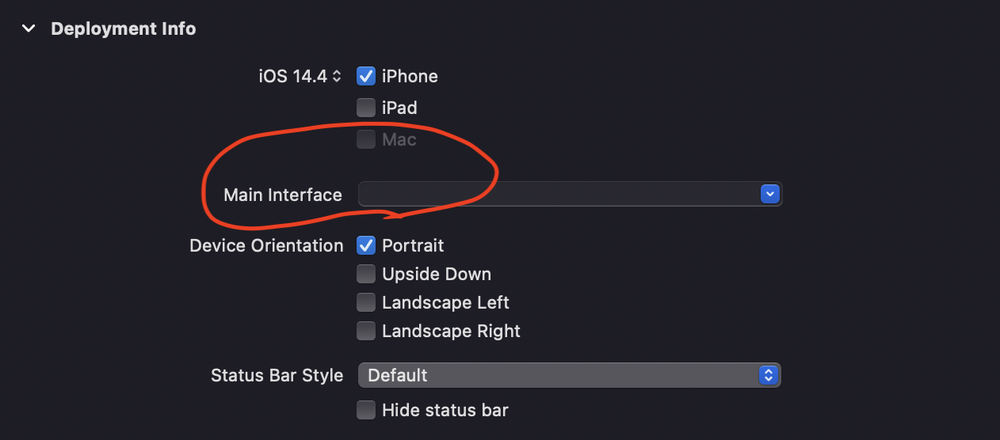
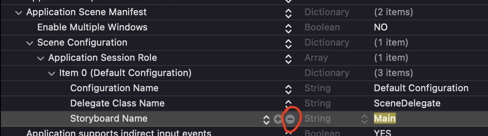
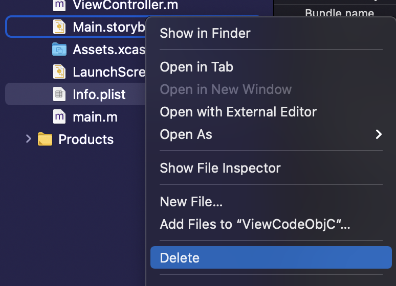
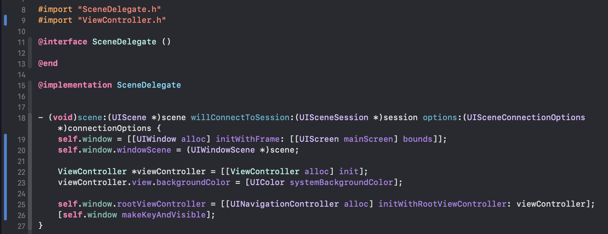
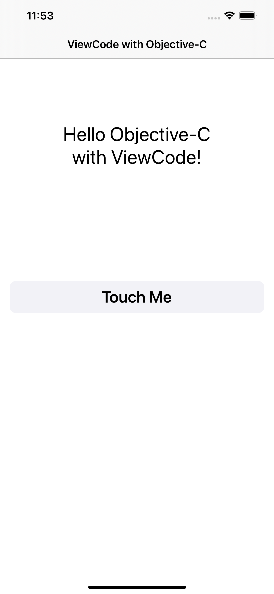
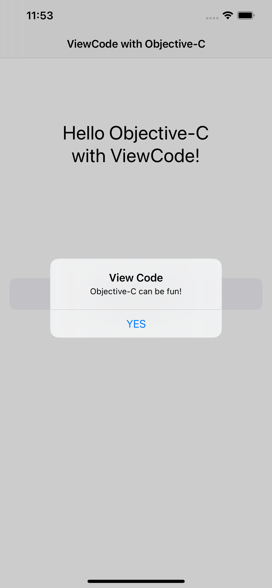
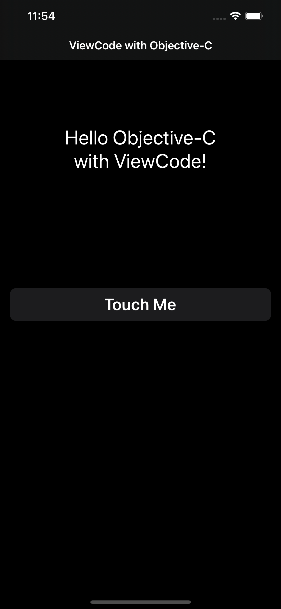
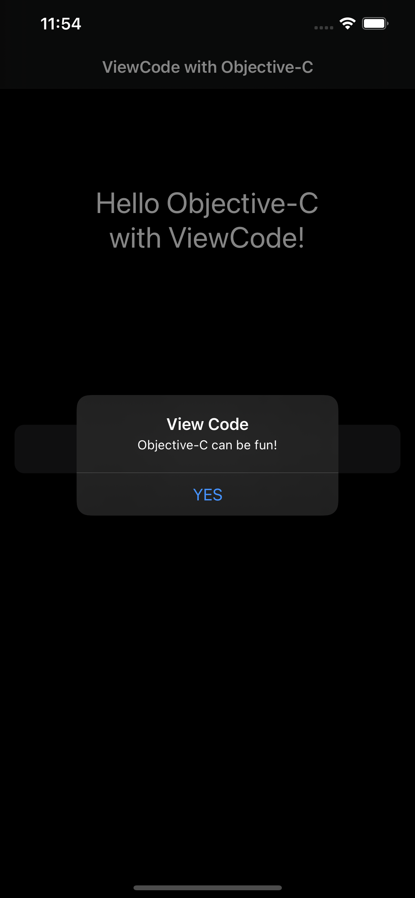

# View Code Objective-C

This is a simple project to demonstrate how to start a project in Objective-C without using Storyboards, only View Code.

## Steps

* After creating the project and selecting Objective-C as language, go to your .xcodeproj file (blue icon at the top hierarchy) and delete the "Main" entry under Deployment Info section.

<br>

* Then go to your Info.plist, search for "Main", and also delete the entry.

<br>

* Now delete your Main.storyboard file (🥳🥳🥳)

<br>

After deleting our Storyboard file, we need to do some coding to setup what ViewController will show up when the app executes. For the sake of this example we'll be using the default ViewController file that is created when we started the new project.

* Go to SceneDelegate.m, and import the ViewController.h file, then add the necessary code under ```willConnectToSession``` method.



```swift
self.window = [[UIWindow alloc] initWithFrame: [[UIScreen mainScreen] bounds]];
self.window.windowScene = (UIWindowScene *)scene;

ViewController *viewController = [[ViewController alloc] init];
viewController.view.backgroundColor = [UIColor systemBackgroundColor];

self.window.rootViewController = [[UINavigationController alloc] initWithRootViewController: viewController];
[self.window makeKeyAndVisible];
```

Let's go through the code:

```swift
self.window = [[UIWindow alloc] initWithFrame: [[UIScreen mainScreen] bounds]];
self.window.windowScene = (UIWindowScene *)scene;
```

This part is responsible for creating a new window object, setting the frame to the screen bounds size and then assigning a new scene to the windowScene.


```swift
ViewController *viewController = [[ViewController alloc] init];
viewController.view.backgroundColor = [UIColor systemBackgroundColor];
```

Here we are allocating and initializing our ViewController (we can call ViewController because we imported earlier), and setting the background color to the system background to support dark mode.

```swift
self.window.rootViewController = [[UINavigationController alloc] initWithRootViewController: viewController];
[self.window makeKeyAndVisible];
```

And in this last part we set the rootViewController as our ViewController, and show it on screen. A quick note here is that I created a UINavigationController to be the window root, and our ViewController is the NavigationController root. But if you don't want to use the NavigationController as root, you could simply pass the ViewController variable just like so:

```swift
self.window.rootViewController = viewController;
```

Now we are all set up, run the project, and you should see a white background, or dark if you switch your simulation to dark mode (Command + Shift + A).

## Result

After adding a little more code, this is the result:

<br>
<br>

Please feel free to clone this project and look up the code, or to contribute in any way!

---

* [LinkedIn](http://linkedin.com/in/adolphopiazza/)
